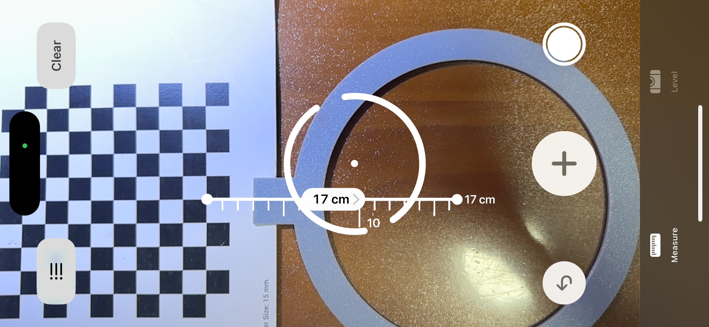

# Pixel2CM

<!-- 在这里可以添加一些徽章，例如构建状态、许可证等 -->
[](./LICENSE)

<div align="center">
  
  <br>
  <em>图源: <a href="https://www.pixiv.net/artworks/94268230">Pixiv @絵葉ましろ</a></em>
</div>

## ✨ 介绍

本项目是一个为 RCJ足球重量组（Open）多摄像头机器人设计的坐标映射工具库。通过逆透视变换算法，本程序可以以机器人圆柱形机身的圆心为原点，建立一个相对坐标系，将摄像头视野中的场地物体（如球、其他机器人）的像素坐标精确转换为以厘米为单位的真实世界坐标。

<div align="center">
  
  <br>
</div>

## ⚠️ 注意事项

- 本项目的矩阵计算高度依赖Numpy、OpenCV等库，故本项目需要在标准Python（如MaixCam、树莓派、Jetson）中运行，不支持MicroPython（如OpenMV）运行

- 若镜头畸变较大，请务必先矫正畸变以确保准确性

- 本程序是基于640*480分辨率摄像头编写的，如要使用其他分辨率需要修改程序内参数

## 🚀 快速上手

### 相机标定（必须）

1. **材料准备**

- 一个10*10的边长为15mm的棋盘格

- 一个标定环

  > 直径18cm用于框住你的机器，带一个夹子用于夹起棋盘格

<div align="center">
  
  <br>
</div>

2. 克隆仓库

3. 打开`cameracalibrate.py`，修改以下两项参数

```python
CamIndex = 0
```

在这里修改你需要标定的摄像头索引。在Linux系统中，可使用`v4l2-ctl --list-devices`命令查看所有摄像头，其中每个摄像头的`/dev/videoX`的这个X就是摄像头索引

```python
Intercept = 17
```

量取你的标定环圆心到第一排内角点的距离，以厘米填入

<div align="center">
  
  <br>
</div>

4. 运行程序。待到窗口弹出，调整棋盘格在视野中的位置，并按下q按键

<div align="center">
  
  <br>
</div>

5. 观察控制台，若有类似下列输出则为标定成功，无则为标定失败。

```python
[(np.float32(485.56906), np.float32(658.57745)), (np.float32(663.97565), np.float32(190.47037)), (np.float32(1347.6478), np.float32(224.37001)), (np.float32(1401.322), np.float32(700.1976))]
(np.float32(485.56906), np.float32(658.57745)) (np.float32(443.94894), np.float32(-257.17548)) (np.float32(1359.7019), np.float32(-215.55536)) (np.float32(1401.322), np.float32(700.1976))
[[ 1.43358179e+00  1.04046407e+00 -6.53419965e+02]
 [-6.36533122e-02  2.69937197e+00 -7.59574034e+02]
 [-4.90854563e-05  7.94013103e-04  1.00000000e+00]]
0.013090458018807
679.3875
25.545506490995635
```
若标定失败，请检查镜头是否对焦成功，画面是否过曝。可尝试调整14-18行并再次尝试

> 如你的机器有多摄，则需要修改CamIndex执行多次标定

### **上手使用**

1. 克隆仓库

2. 执行下列语句实例化转换器

```python
from pixel2cm import Pixel2CM
Converter = Pixel2CM()
```

若出现报错，请检查标定文件是否完好

3. 使用转换器

```python
# Converter.Pixel2CM(X,Y,CamIndex)
>>> Converter.Pixel2CM(400,400,0)
(4, 10)

# Converter.CM2Pixel(X,Y,CamIndex)
>>> Converter.CM2Pixel(4,10,0)
(395, 411)
```


